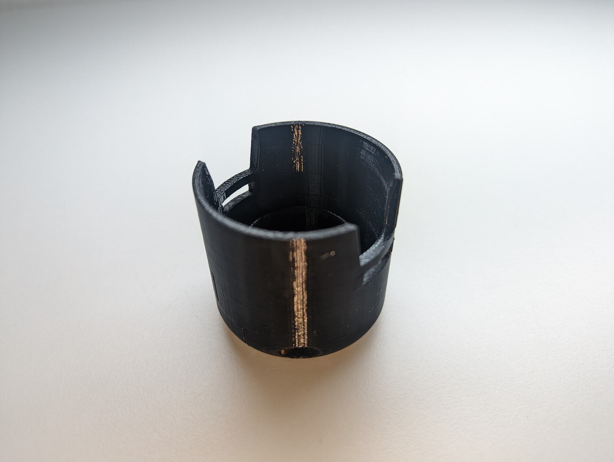
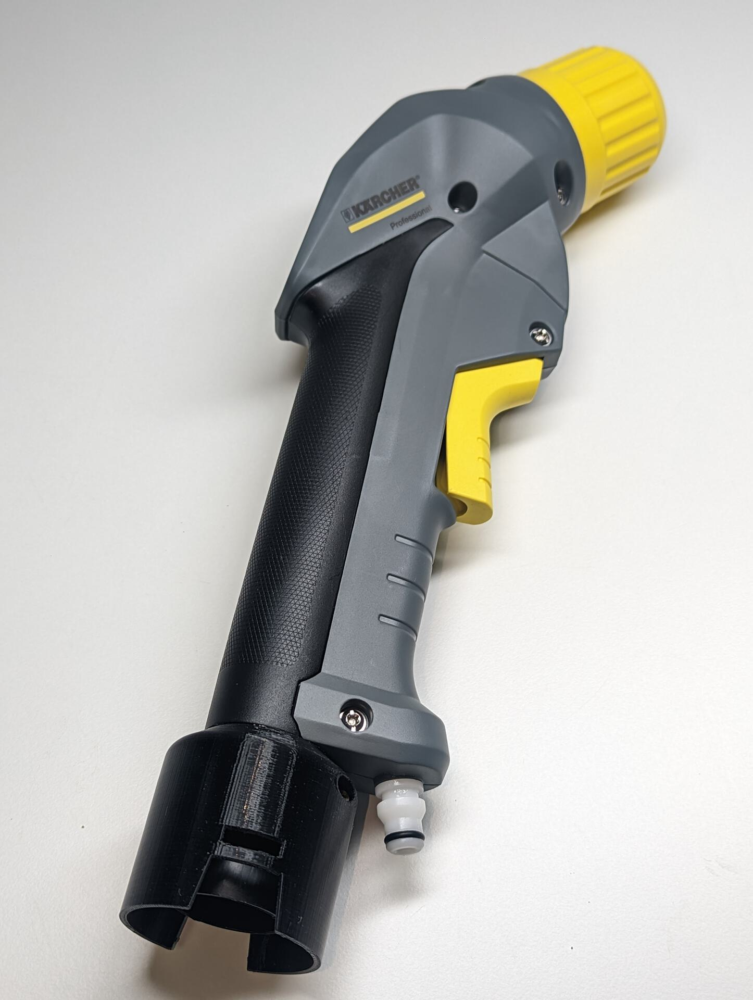
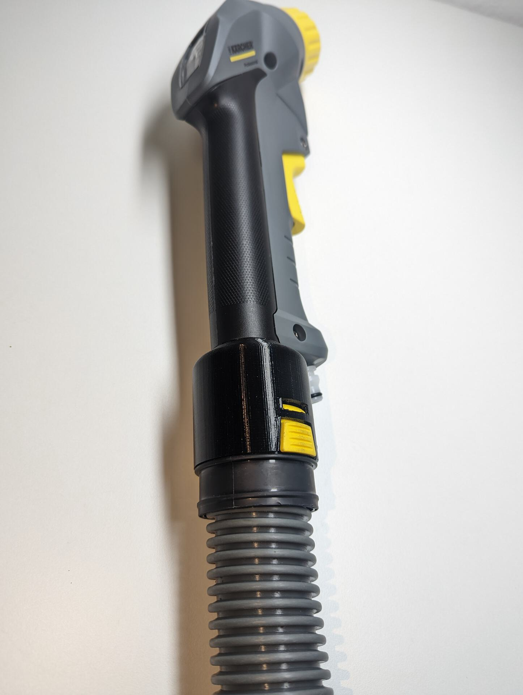

Kärcher NT to Puzzi Handle Adapter
================
This adapter is designed to connect the 4.130-000.0 handle from a Puzzi spray extraction cleaner to a standard Kärcher NT wet & dry vacuum cleaner with clip 2.0 suction hose, like the 2.889-135.0 DN35 suction hose.
Clip 2.0 connections are present on Kärcher NT vacuum cleaners starting from manufacturing year 2017.

Requires a single 3x16mm countersunk self tapping screw to firmly secure the adapter to the handle.

The adapter `puzzi_nt_clip2_adpater.stl`

Connected to the Puzzi spray extraction handle (4.130-000.0). Stays permanently attached to the handle. Only suction hose can be removed quickly.

Connected to the DN35 Clip2.0 suction hose (2.889-135.0)

Water connection from pump sprayer to handle to be added at a later stage.